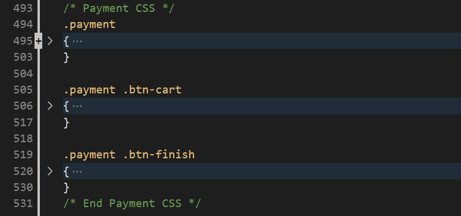

# SCC0219_Trabalho_Web

Trabalho em grupo da disciplina de Introdução ao Desenvolvimento Web - 1º semestre, 2022.

## Membros:

- Giovanni Shibaki Camargo (11796444)
- Lucas Keiti Anbo Mihara (11796472)
- Vítor Caetano Brustolin (11795589)

## Requisitos

- O sistema possui 2 tipos de usuários: Clientes e Administradores.
    - Os administradores são responsáveis por registrar e manejar outros administradores, clientes e cartas de pokémon oferecidas. A aplicação deverá vir com uma conta de administrador com email **admin@admin.com** e senha **admin**. (**Este exato email e senha são necessários para logar como Admin e acessar as páginas destinadas aos Administradores**).
    - Os clientes são usuários que acessam o sistema para comprar cartas.
- O registro de administrador deve incluir: id, nome, telefone, email e senha.
- O registro de cada cliente deve incluir: id, nome, email, senha, endereço e telefone.
- Os registros das cartas devem incluir: nome, preço, quantidade (em estoque) e descrição.
- Venda de cartas de pokemon: Cartas e suas quantidades são selecionados e incluidas no carrinho. As cartas são compradas utilizando dados de cartão de crédito (qualquer número é aceito pelo sistema). A quantidade vendida de cartas é subtraída da quantidade em estoque e adicionada à quantidade vendida. O carrinho é esvaziado somente após o pagamento ou manualmente pelo cliente.
- Manejo de cartas: Administradores devem ser capazes de criar, atualizar, ler e deletar (CRUD) novas cartas de Pokemon. Por exemplo, eles devem ser capazes de mudar a quantidade de cartas em estoque.
- O sistema deve conter requisitos de accessibilidade e prover boa usabilidade para o cliente, sendo responsível ao aplicar zoom ou visualizar em diferentes resoluções de tela.

### Funcionalidade extra:

- Todos os dias, ao entrar na aplicação, o cliente pode entrar em uma tela chamada **Carta do dia**, na qual uma das cartas presentes na loja será sorteada e terá um desconto especial naquele dia apenas para aquele cliente.

- Para o Milestone 2, como a aplicação ainda não possui banco de dados, uma carta aleatória será sorteada para ser exibida.

## Descrição do projeto

- O projeto desenvolvido trata-se de uma loja de cartas colecionáveis de pokemon que também podem ser utilizadas para partidas reais. As funcionalidades apresentadas no tópico anterior foram organizadas da seguinte forma:

- A partir de todas as páginas da plataforma é possível acessar a Página Principal através do cabeçalho.

- O cliente pode realizar login e cadastro através da página de **Sign In / Up**.

- Após logado, o cliente pode editar as informações cadastradas em seu perfil através da página **Edit Profile**

- A todo momento é possível acessar a página de carrinho (**Cart**) através do ícone presente no cabeçalho.

- A todo momento é possível acessar a página de catálogo (**Catalogue**) através do ícone presente no cabeçalho.

- Quando logado em uma conta de administrador, será possível acessar a página **Admin Page** atrvés de um botão que estará presente no dropdown ao passar com o mouse sobre o nome de usuário logado presente no canto superior direito da tela. Dessa forma, na página do administrador será possível acessar todas as funcionalidades voltadas aos administradores.

- Além disso, na página de **Item**, quando logado como administrador, será visível um botão de editar item, que fará irá para a página **Edit Card** para edição do item selecionado.

### Informações armazenadas no servidor

- Informações sobre os usuários clientes (id, nome, email, senha, endereço, telefone e foto de perfil);
- Informações sobre os usuários administradores (id, nome, telefone, email e senha);
- Informações sobre as cartas (nome, id, imagem, descrição, série (coleções de cartas de cada geração), categoria, preço, quantidade (em estoque), quantidade vendida).
- Data da última carta do dia sorteada por cada usuário, a carta sorteada e o valor de desconto

## Comentários sobre o código

- O arquivo de estilização CSS está dividido em sessões para cada parte essencial das páginas. Essa divisão é feita de forma simples através de comentários que explicitam o inicio e fim dos blocos de código de cada página. Vide exemplo abaixo:

- Como utilizamos diferentes componentes para cada página do site, os arquivos referentes a cada página estão presentes na pasta **/src/views/**. Dentro de cada arquivo .vue está o código de marcação (HTML), estilização (CSS) e script (JAVASCRIPT) utilizado em cada uma das páginas.

- Vale notar que, como se trata de uma SPA (Single Page Application), os componentes são dinamicamente carregados dentro de um componente principal (**App.vue**) que possui o cabeçalho, rodapé e uma TAG especial do **Vue Router** (\<router-view\>) responsável por carregar dinamicamente os componentes de cada página, sem recarregar toda a página.

## Plano de testes

A seguir estão listados os testes realizados:
1) Busca de carta por nome
    - Buscar por uma carta no catálogo por meio de uma string de busca a partir da barra de busca presente no cabeçalho do site.
2) Filtragem por categoria
    - Testar se, na página de catálogo, ao clicar em uma das diferentes categorias, apenas as cartas daquela categoria são exibidas.
3) Navegação nas diferentes páginas do catálogo
    - Testar se a barra de navigate, presente no final da página de catálogo, funciona conforme esperado.
4) Adicionar item ao carrinho
    - Através do botão **Add** presente na página principal, catálogo, página do item
    - Através do botão **Add to Cart** presente na página do Item
5) Remover um item do carrinho
    - Na página do carrinho testar se o item será removido ao clicar no botão **Remove**
6) Testar a máscara de input em alguns dos campos presentes no site
7) Testar funcionalidade de edição de carta quando logado como Administrador

## Resultados dos testes

1) As buscas por cartas funcionam conforme esperado
2) Ao selecionar cada categoria, as cartas exibidas no catálogo são atualizadas conforme esperado
3) A navegação nas diferentes páginas do catálogo funciona conforme esperado, alterando o número de páginas caso alguma categoria específica tenha sido selecionada ou uma busca tenha sido realizada no catálogo
4) O item é adicionado ao carrinho em ambos os casos, sendo que na página do item é possível adicionar a quantidade especificada no campo de quantidade a ser adicionada ao carrinho.
5) Na página do carrinho, ao clicar no botão **Remove** a carta será removida do carrinho independentemente do número de cartas de um mesmo item conforme o esperado.
6) A maioria dos campos numéricos possui máscaras de input.
7) Quando logado como Administrador, ao selecionar uma carta do catálogo e clicar para editar o item, as informações a serem editadas da carta são exibidas.

## Procedimentos de build

- Para o Milestone 2 foram apenas desenvolvidos todas as páginas do sistema ([link figma](https://www.figma.com/file/vWXNlQr1lu3tz3Tc1HSfxf/PokemonCards-Mockup?node-id=0%3A1)) utilizando o framework [Vue](https://pt.wikipedia.org/wiki/Vue.js).

- Todas as componentes (HTML + CSS + JAVASCRIPT) desenvolvidas estão presentes na pasta **/src/**, sendo que, para o desenvolvimento de uma SPA (Single Page Application) utilizou-se o [Vue Router](https://router.vuejs.org/), fazendo com que os componentes da página sejam dinamicamente carregados durante a nevegação do usuário.

- As componentes desenvolvidas são as seguintes:
    - **App.vue**: componente principal contendo header, footer e as demais componentes dinamicamente carregadas.
    - **AdminPageView.vue**: página do administrador para inserção de novos clientes/administradores e cartas.
    - **CardOfTheDayView.vue**: página da funcionalidade extra de carta do dia.
    - **CartView.vue**: página do carrinho de compras.
    - **CatalogueView.vue**: página de catálogo das cartas Pokémon.
    - **ChangeInfoView.vue**: página de edição de perfil.
    - **EditCardViewView.vue**: página de edição de carta pelo administrador.
    - **HomeView.vue**: página principal do site.
    - **ItemPageView.vue**: página individual do item.
    - **PaymentView.vue**: página de pagamento.
    - **SignInUpView.vue**: página de login e cadastro.

### Tutorial de Build

Abaixo, um pequeno tutorial de como rodar e visualizar as páginas do site:

Observação: Como, para a Milestone 2 ainda não utilizamos banco de dados para a correta exibição, inclusão e alteração das informações de clientes, administradores e cartas, ainda não fizemos uma build do projeto. Dessa forma, o projeto deve ser executado em modo de desenvolvimento seguindo o passo a passo a seguir.

    Pra executar a aplicação é preciso que o software Node.js esteja instalado em sua máquina. Basta seguir o tutorial abaixo:        
    https://nodejs.org/en/

    Faça download do projeto por meio do botão [Code] -> [Download ZIP] presente no GitHub e decompacte o arquivo .ZIP, ou clone o projeto em sua pasta de preferência.

    Depois, por meio do terminal, dentro da pasta do projeto, executar o comando abaixo:
    > npm install

    Em seguida, para executar o projeto, basta utilizado o comando abaixo:
    > npm run serve

    Por fim, em seu navegador, vá para a url abaixo: 
    localhost:8080/

    Pronto! Você agora estará na página principal de nosso site!

## Problemas

- Sem grandes problemas até esta etapa de desenvolvimento.

## Comentários

- Foi possível revisar diversos conceitos aprendidos em aula sobre HTML, CSS e JAVASCRIPT, além de aprender novas tags e atributos de estilização para personalizar diversos aspectos do sistema e deixar parecido com o que planejamos nos mockups do sistema.
- Além disso, pôde-se aprender o processo de desenvolvimento web utilizando o framework **Vue JS** e o desenvolvimento de um SPA (Single Page Application) de forma a criar uma interface rápida e agradável aos usuários.

