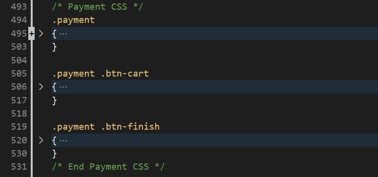

# SCC0219_Trabalho_Web

Trabalho em grupo da disciplina de Introdução ao Desenvolvimento Web - 1º semestre, 2022.

## Membros:

- Giovanni Shibaki Camargo (11796444)
- Lucas Keiti Anbo Mihara (11796472)
- Vítor Caetano Brustolin (11795589)

## Requisitos

- O sistema de ter 2 tipos de usuários: Clientes e Administradores.
    - Os administradores são responsáveis por registrar e manejar outros administradores, clientes e cartas de pokémon oferecidas. A aplicação deverá vir com uma conta de administrador com nome **admin** e senha **admin**. 
    - Os clientes são usuários que acessam o sistema para comprar cartas.
- O registro de administrador deve incluir: id, nome, telefone, email e senha.
- O registro de cada cliente deve incluir: id, nome, email, senha, endereço, telefone e foto de perfil.
- Os registros das cartas devem incluir: nome, id, imagem, descrição, série (coleções de cartas de cada geração), categoria, preço, quantidade (em estoque), quantidade vendida.
- Venda de cartas de pokemon: Cartas e suas quantidades são selecionados e incluidas no carrinho. As cartas são compradas utilizando dados de cartão de crédito (qualquer número é aceito pelo sistema). A quantidade vendida de cartas é subtraída da quantidade em estoque e adicionada à quantidade vendida. O carrinho é esvaziado somente após o pagamento ou manualmente pelo cliente.
- Manejo de cartas: Administradores devem ser capazes de criar, atualizar, ler e deletar (CRUD) novas cartas de Pokemon. Por exemplo, eles devem ser capazes de mudar a quantidade de cartas em estoque.
- O sistema deve conter requisitos de accessibilidade e prover boa usabilidade para o cliente, sendo responsível ao aplicar zoom ou visualizar em diferentes resoluções de tela.

### Funcionalidade extra:

- Todos os dias, ao entrar na aplicação, o cliente pode entrar em uma tela chamada **Carta do dia**, na qual uma das cartas presentes na loja será sorteada e terá um desconto especial naquele dia apenas para aquele cliente.

## Descrição do projeto

- O projeto desenvolvido trata-se de uma loja de cartas colecionáveis de pokemon que também podem ser utilizadas para partidas reais. As funcionalidades apresentadas no tópico anterior foram organizadas da seguinte forma:

- A partir de todas as páginas da plataforma é possível acessar a Página Principal através do cabeçalho.

- O cliente pode realizar login e cadastro através da página de **Sign In / Up**.

- Após logado, o cliente pode editar as informações cadastradas em seu perfil através da página **Edit Profile**

- A todo momento é possível acessar a página de carrinho (**Cart**) através do ícone presente no cabeçalho.

- A todo momento é possível acessar a página de catálogo (**Catalogue**) através do ícone presente no cabeçalho.

- Quando logado em uma conta de administrador, será possível acessar a página **Admin Page** atrvés de um botão que irá aparecer no cabeçalho. Dessa forma, na página do administrador será possível acessar todas as funcionalidades voltadas aos administradores.

- Além disso, na página de **Item**, quando logado como administrador, será visível um botão de editar item, que fará irá para a página **Update / Delete Card** para edição do item selecionado.

### Informações armazenadas no servidor

- Informações sobre os usuários clientes (id, nome, email, senha, endereço, telefone e foto de perfil);
- Informações sobre os usuários administradores (id, nome, telefone, email e senha);
- Informações sobre as cartas (nome, id, imagem, descrição, série (coleções de cartas de cada geração), categoria, preço, quantidade (em estoque), quantidade vendida).
- Data da última carta do dia sorteada por cada usuário, a carta sorteada e o valor de desconto

## Comentários sobre o código

- O arquivo de estilização CSS está dividido em sessões para cada parte essencial das páginas. Essa divisão é feita de forma simples através de comentários que explicitam o inicio e fim dos blocos de código de cada página. Vide exemplo abaixo:

## Plano de testes

- Planeja-se testar funcionalidades básicas voltadas ao uso de informações vindas do banco de dados. Serão feitos testes como:
    - Teste de consistência de login / cadastro;
    - Teste de consistência de compra de cartas;
    - Teste de consistência na inserção / edição de cartas (como nomes iguais, por exemplo).

## Resultados dos testes

- Ainda não há testes realizados. Apenas parte de seu planejamento conforme acima.

## Procedimentos de build

- Para o Milestone 1 foram apenas desenvolvidos Mockups das páginas principais do sistema e o desenvolvimento em HTML e CSS de 3 dessas páginas.

- Os mockups desenvolvidos para essa entrega estão presentes na pasta **mockups** em formato PNG.

- As três páginas desenvolvidas em HTML e CSS são as seguintes:
    - **index.html**
    - **catalogo.html**
    - **sign-in-up.html**
    - **css/style.css**

- Para visualizar as páginas corretamente, basta fazer download deste projeto do GitHub, descompactar o arquivo baixado, e abrir em seu navegador os arquivos HTML.

## Problemas

- Sem grandes problemas até esta etapa de desenvolvimento.

## Comentários

- Foi possível revisar diversos conceitos aprendidos em aula sobre HTML e CSS, além de aprender novas tags e atributos de estilização para personalizar diversos aspectos do sistema e deixar parecido com o que planejamos nos mockups do sistema.

